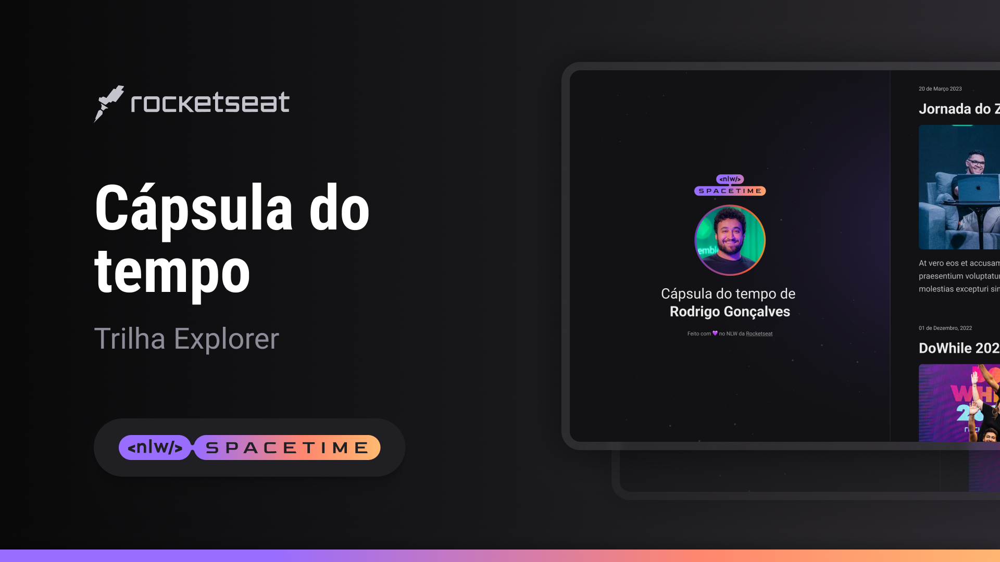

 
  

## 💻 Projeto

Esse é um projeto Web Responsivo de uma cápsula do tempo para exibir memórias em uma linha do tempo.

## 🚀 Tecnologias

Foi desenvolvido durante o NLW do RocketSeat com as seguintes tecnologias:

- HTML
- CSS
- Git e GitHub

## ✔️ Layout

Você pode visualizar o layout do projeto através
[desse link](https://www.figma.com/file/NVFCp4iwut8qR1TIO73UjJ/C%C3%A1psula-do-tempo-%E2%80%A2-Trilha-Explorer-(Community)-(Copy)?type=design&node-id=306%3A84&t=LNk8eJEJJQifVzbj-1).
É necessário ter uma conta no [Figma](https://www.figma.com).